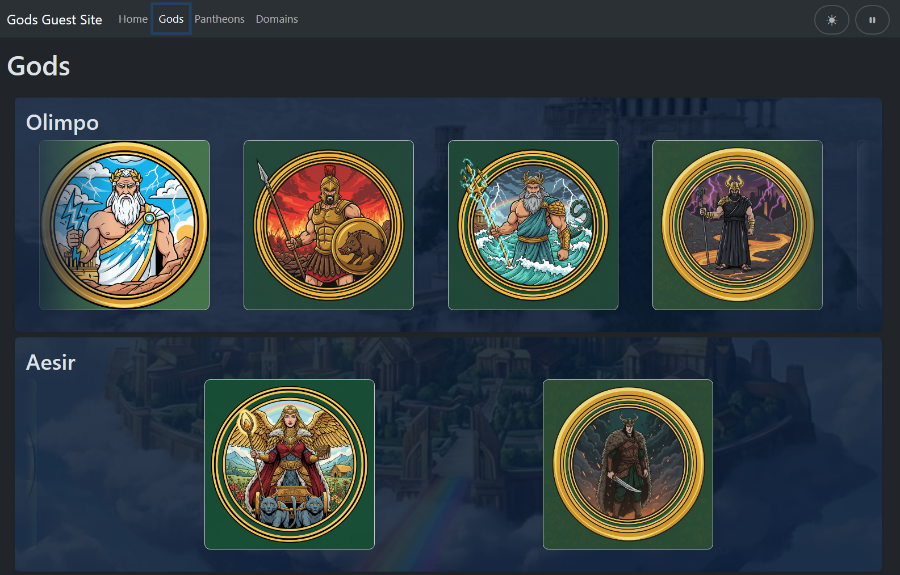

# Gods Guest Site

Frontend React dedicato alla consultazione di dei, pantheon e domini mitologici.
Il progetto usa Vite, React Router e una Context API globale per gestire configurazione API, stato di loading e preferenze UI.

## Funzionalita principali

- Navigazione con routing client-side per Home, Gods, Pantheons, Domains e pagina 404.
- Pagine lista e dettaglio per ogni risorsa principale.
- Richieste HTTP con Axios verso API esterne configurabili via variabili ambiente.
- Loader globale durante il fetch dati.
- Toggle tema `light/dark` persistito in `localStorage`.
- Toggle animazioni per attivare/disattivare caroselli e transizioni.

## Stack tecnico

- React 19 + Vite
- React Router DOM 7
- Axios
- Bootstrap 5 + Bootstrap Icons
- Font Awesome
- Styled Components
- ESLint

## Requisiti

- Node.js 18+ (consigliato LTS)
- npm 9+

## Installazione

```bash
npm install
```

## Configurazione ambiente

Il progetto legge queste variabili da file `.env` / `.env.local`:

```env
VITE_API_STORAGE_URL=
VITE_API_URL_GODS=
VITE_API_URL_PANTHEONS=
VITE_API_URL_DOMAINS=
```

Esempio rapido:

```env
VITE_API_STORAGE_URL=http://localhost:8000/storage
VITE_API_URL_GODS=http://localhost:8000/api/gods
VITE_API_URL_PANTHEONS=http://localhost:8000/api/pantheons
VITE_API_URL_DOMAINS=http://localhost:8000/api/domains
```

## Script disponibili

- `npm run dev`: avvia il server di sviluppo.
- `npm run build`: genera la build di produzione.
- `npm run preview`: anteprima locale della build.
- `npm run lint`: esegue il lint del progetto.

## Routing

- `/` -> HomePage
- `/gods` -> GodIndexPage
- `/gods/:id` -> GodShowPage
- `/pantheons` -> PantheonIndexPage
- `/pantheons/:id` -> PantheonShowPage
- `/domains` -> DomainIndexPage
- `/domains/:id` -> DomainShowPage
- `*` -> NotFoundPage

## Struttura progetto

```text
src/
	components/      # Header, card, caroselli, loader
	context/         # GlobalContext
	layouts/         # DefaultLayout
	pages/           # Home, 404, sezioni gods/pantheons/domains
	App.jsx          # Provider globale + routing
	main.jsx         # Entry point
```

## Note architetturali

- `GlobalContext` espone URL API, `loading`, preferenze tema e animazioni.
- `DefaultLayout` monta header, loader e outlet delle route figlie.
- Le pagine dettaglio gestiscono il fallback su route indice in caso di `404` API.

## Possibili miglioramenti

- Gestione centralizzata errori con UI dedicata.
- Test unit/integration (es. Vitest + React Testing Library).
- Introduzione TypeScript o validazione schema API.

## Licenza

Progetto a scopo didattico.
